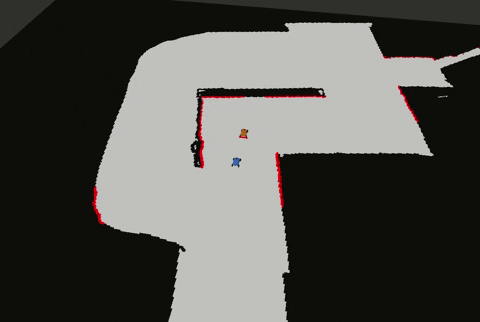

This is our package for Project Milestone 4

## Milestone 4 (Final race):

Our solution tries to combine safety of formal methods with performance of learning based methods, given a set of spline paths, the RL-based high-level decision maker learns to choose a path to follow based on the current observations of the race
Then our controller uses the action (decided path), confirms with TTC for availability of the path and uses pure pursuit to follow the decision.

  

### Structure of SQN policy -- state to action
 

### Overall Reinforcement Learning Training Strategy (self play, adversarial style learning)

- Train ego agent against pure-pursuit opponent agent without notion of obstacles
   - Did not learn a good policy because opponent agent doesn’t react
   - Therefore...
- Train ego agent against opponent agent following a path with TTC reaction
- Train ego agent against the previously learned policy
- Repeat

- Some additional things
  - Cosine learning rate schedule
  - Randomly initialize agents to be in first or second position at start 
 
We have included both the new and old f110 simulators in this repository. Make sure that the new simulator pre requisites are properly installed (docker,etc.).
    
### To run our code:

  * Clone this repositpory in src folder of your ROS workspace and catkin_make the workspace (make sure you dont have a duplicate new or old F110 simulator in your workspace since that might cause issues when making the workspace)

Then run the following depending on which simulator you are planning on using:

For the old simulator:

  *  Run the following in a new terminal: `roslaunch second_race race_old.launch`

For the new simulator:

  *  Go to `f1tenth_gym_ros` folder and run the following in a new terminal: `sudo ./docker.sh`
  *  Run the following in a new terminal: `roslaunch second_race race_new.launch`

Paths

We don’t use the optimized raceline but sample enough paths to all possible choices for car.
 
*  We created 10 lanes that go around the track (used for the action space of our RL) and you can see them below:
  
  

  

  * In case the obstacles cover all the avaliable paths, we create the Multi-Paths2 with 20 lanes, we then created more lanes in order to cover more of the track.
  
  

  

  
