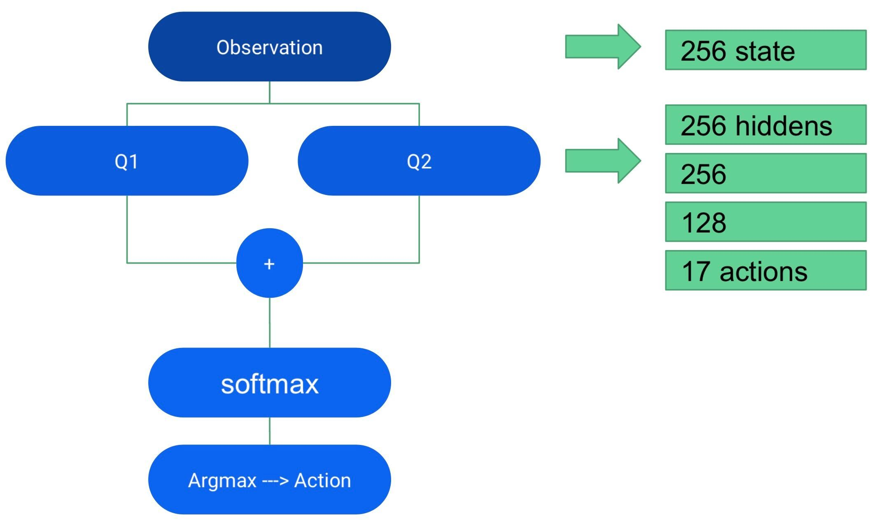

This is our package for Project Milestone 4

## Milestone 4 (Final race):

Our solution tries to combine safety of formal methods with performance of learning based methods, given a set of spline paths, the RL-based high-level decision maker learns to choose a path to follow based on the current observations of the race
Then our controller uses the action (decided path), confirms with TTC for availability of the path and uses pure pursuit to follow the decision. In the gif below you can see how we perfrom against an opponent agent (Our agent is blue).

  

### Structure of SQN policy -- state to action

Modified from Soft Actor Critic from OpenAI SpinningUp https://spinningup.openai.com/en/latest/
 

  

 
- Based on Clipped Double Q-learning - Fujimoto 2018      
- Outputs discrete actions      
- Using entropy regularized exploration     

### Overall Reinforcement Learning Training Strategy (self play, adversarial style learning)

- Train ego agent against pure-pursuit opponent agent without notion of obstacles
   - Did not learn a good policy because opponent agent doesn’t react
   - Therefore...
- Train ego agent against opponent agent following a path with TTC reaction
- Train ego agent against the previously learned policy
- Repeat

- Some additional things
  - Cosine learning rate schedule
  - Randomly initialize agents to be in first or second position at start 
 
## Logistics

We have included both the new and old f110 simulators in this repository. Make sure that the new simulator pre requisites are properly installed (docker,etc.).

**To run our code:**

#### Final Race: moving opponent, no obstacles

For the new simulator:

  *  Go to `f1tenth_gym_ros` folder and run the following in a new terminal: `sudo ./docker.sh`
  *  Run the following in a new terminal: `roslaunch final_race race_new.launch`
