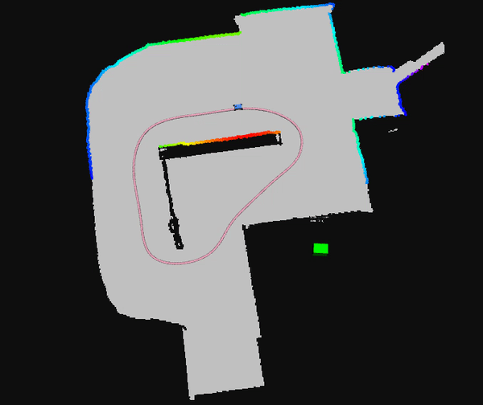
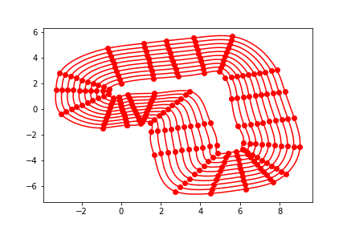

This is our package for Project Milestone 2

## Milestone 2 (Race one):

The only purpose is to complete going around the race track in shortest time possible. There are not any other competitors in the race. We found the shortest path around the track (using b-spline) and are using pure pursuit algorithm to track the path around the track. Uisng the old f110 simulator you can see the purformance of our method around the track (the optimized path is pink) :

  

We have included both the new and old f110 simulators in this repository. Make sure that the new simulator pre requisites are properly installed (docker,etc.).

To run our code:

  * Clone this repositpory in src folder of your ROS workspace and catkin_make the workspace (make sure you dont have a duplicate new or old F110 simulator in your workspace since that might cause issues when making the workspace)

Then run the following depending on which simulator you are planning on using:

For the old simulator:

  *  Run the following in a new terminal: `roslaunch first_race race_old.launch`

For the new simulator:

  *  Go to `f1tenth_gym_ros` folder and run the following in a new terminal: `sudo ./docker.sh`
  *  Run the following in a new terminal: `roslaunch first_race race_new.launch`

In addition to finishing the requirisites for the first race, we have completed the following milestones preparing for the final race:

  *  We created 10 lanes that go around the track (used for the action space of our RL) and you can see them below:
  
  

  

  
  
  *  We Implemented the foundation/structure of SQN for training. This includes defining appropriate observation state and possible reward structure
  *  We are almost done with integrating pure pursuit with RL structure so that we can take RL output and act on it and control the car appropritely
