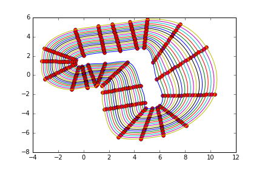

This is our package for Project Milestone 3

## Milestone 3 (Race two):

The main goal is to drive safely around the track by avoiding obstacles. The method we used to approach this problem is with a high level ttc style calculation to decide on which path provides the most space. We follow the waypoint associated with the best ttc path with pure pursuit in get a steering angle and velocity.

  

We have included both the new and old f110 simulators in this repository. Make sure that the new simulator pre requisites are properly installed (docker,etc.).

### To run our code:

  * Clone this repositpory in src folder of your ROS workspace and catkin_make the workspace (make sure you dont have a duplicate new or old F110 simulator in your workspace since that might cause issues when making the workspace)

Then run the following depending on which simulator you are planning on using:

For the old simulator:

  *  Run the following in a new terminal: `roslaunch second_race race_old.launch`

For the new simulator:

  *  Go to `f1tenth_gym_ros` folder and run the following in a new terminal: `sudo ./docker.sh`
  *  Run the following in a new terminal: `roslaunch second_race race_new.launch`

Paths

*  We created 10 lanes that go around the track (used for the action space of our RL) and you can see them below:
  
  

  

  * In case the obstacles cover all the avaliable paths, we create the Multi-Paths2 with 20 lanes, we then created more lanes in order to cover more of the track.
  
  

  

